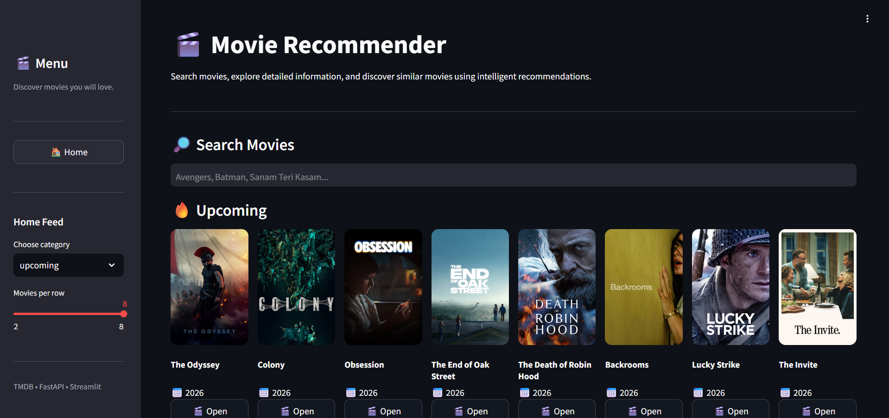
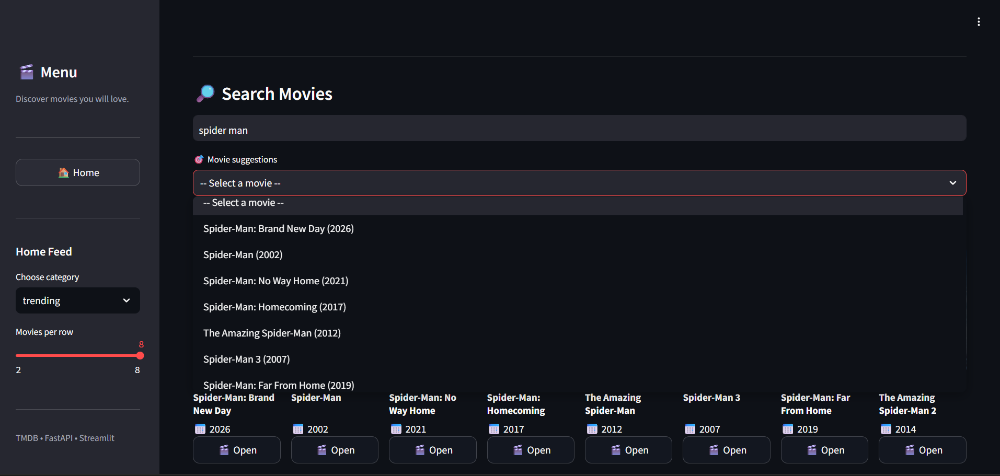
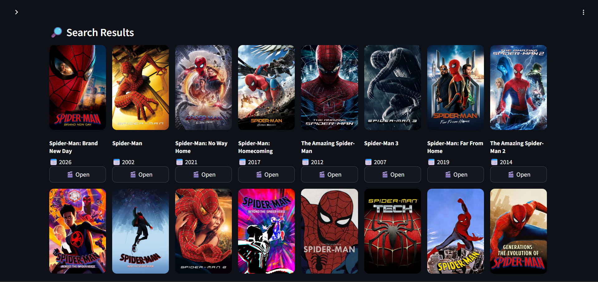

# 🎬 Movie Recommendation System

A full-stack movie discovery and recommendation application built with **Streamlit**, **FastAPI**, **TF-IDF**, and the **TMDB API**.

The application allows users to search for movies, explore movie details, browse different movie categories, and discover similar movies using a content-based recommendation approach.

---

## 🌐 Live Demo

[](https://movie-recommendation-system-2wx1.onrender.com)

---

## ✨ Features

* 🔎 Search movies by title
* 🎬 Explore movie posters and release information
* 📖 View detailed movie information and overviews
* 🤖 Get similar movie recommendations using TF-IDF
* 🎭 Discover movies based on genre
* 🔥 Browse trending movies
* ⭐ Explore popular and top-rated movies
* 🎞️ Browse currently playing and upcoming movies
* 🖼️ Display movie posters and backdrops
* 📱 Responsive Streamlit interface
* ⚡ FastAPI backend with dedicated endpoints
* ❤️ Interactive movie discovery experience

---

## 🛠️ Tech Stack

| Category             | Technologies                            |
| -------------------- | --------------------------------------- |
| **Frontend**         | Streamlit                               |
| **Backend**          | FastAPI, Uvicorn                        |
| **Machine Learning** | Scikit-learn, TF-IDF, Cosine Similarity |
| **Data Processing**  | Pandas, NumPy, SciPy                    |
| **External API**     | TMDB API                                |
| **HTTP Requests**    | Requests, HTTPX                         |
| **Configuration**    | Python-dotenv                           |
| **Deployment**       | Render                                  |

---

## 🧠 How It Works

The application follows a simple movie discovery and recommendation workflow.

### 1. 🔎 Movie Search

The user searches for a movie through the Streamlit interface.

The request is sent to the FastAPI backend, which communicates with the TMDB API to retrieve matching movies.

### 2. 🎬 Movie Details

After selecting a movie, the application retrieves information such as:

* Movie title
* Poster
* Release date
* Rating
* Overview
* Genres
* Backdrop

### 3. 🤖 Content-Based Recommendation

The project uses precomputed TF-IDF resources to represent movie information numerically.

The selected movie is mapped to its corresponding index and its TF-IDF representation is compared with other movies.

### 4. 📊 Similarity Calculation

Cosine similarity is used to determine how closely movies are related.

Movies with higher similarity scores are selected as recommendations.

### 5. 🎯 Results

The recommended movies are displayed through the Streamlit interface along with relevant movie information and posters.

---

## 🤖 Recommendation System

The recommendation engine uses a **content-based filtering approach** based on **TF-IDF and similarity calculations**.

The project includes precomputed machine-learning resources:

```text
df.pkl
indices.pkl
tfidf.pkl
tfidf_matrix.pkl
```

The recommendation process works by:

1. Finding the selected movie in the dataset.
2. Retrieving its corresponding TF-IDF representation.
3. Comparing it with the movie matrix.
4. Calculating similarity scores.
5. Sorting movies based on similarity.
6. Returning the most similar titles.

This approach allows the system to recommend movies that are similar to the movie selected by the user.

---

## 🎭 Genre-Based Recommendations

The application also provides genre-based recommendations.

For a selected movie, the backend retrieves its TMDB information, identifies its genre, and uses TMDB's movie discovery functionality to find movies from that genre.

---

## 📁 Project Structure

```text
Movie-Recommendation-System/
│
├── .gitignore
├── .python-version
│
├── Movie-Recommendation-System.ipynb
│
├── app.py
├── main.py
│
├── movies_metadata.csv
│
├── df.pkl
├── indices.pkl
├── tfidf.pkl
├── tfidf_matrix.pkl
│
├── favicon.png
├── requirements.txt
├── runtime.txt
│
└── README.md
```

### Key Files

| File                                | Purpose                                      |
| ----------------------------------- | -------------------------------------------- |
| `app.py`                            | Streamlit frontend and user interface        |
| `main.py`                           | FastAPI backend and recommendation/API logic |
| `movies_metadata.csv`               | Movie metadata dataset                       |
| `df.pkl`                            | Preprocessed movie dataframe                 |
| `indices.pkl`                       | Movie-to-index mapping                       |
| `tfidf.pkl`                         | Trained TF-IDF vectorizer                    |
| `tfidf_matrix.pkl`                  | Precomputed TF-IDF matrix                    |
| `requirements.txt`                  | Python dependencies                          |
| `runtime.txt`                       | Runtime configuration                        |
| `favicon.png`                       | Application favicon                          |
| `Movie-Recommendation-System.ipynb` | Notebook used for project/model development  |

---

## ⚙️ Installation & Setup

### 1. Clone the Repository

```powershell
git clone https://github.com/athrv18/Movie-Recommendation-System.git
```

### 2. Navigate to the Project

```powershell
cd Movie-Recommendation-System
```

### 3. Create a Virtual Environment

```powershell
python -m venv venv
```

### 4. Activate the Virtual Environment

```powershell
.\venv\Scripts\Activate.ps1
```

### 5. Install Dependencies

```powershell
pip install -r requirements.txt
```

---

## 🔐 Environment Variables

The FastAPI backend requires a TMDB API key.

Create a `.env` file in the project root:

```env
TMDB_API_KEY=your_tmdb_api_key
```

Keep your API key private and **never commit it to GitHub**.

---

## ▶️ Running the Application

The project consists of two services:

* **FastAPI** — Backend API
* **Streamlit** — Frontend interface

### Start the FastAPI Backend

```powershell
uvicorn main:app --reload
```

### Start the Streamlit Frontend

Open a second terminal and run:

```powershell
streamlit run app.py
```

The Streamlit application communicates with the FastAPI backend through the configured API base URL.

---

## 🎯 Usage

1. Start the FastAPI backend.
2. Start the Streamlit application.
3. Open the Streamlit application in your browser.
4. Search for a movie.
5. Select a movie from the results.
6. Explore its details.
7. View similar movie recommendations.
8. Explore genre-based recommendations.
9. Browse categories such as trending, popular, top-rated, now-playing, and upcoming movies.

---

## 🌐 Deployment

The application is deployed using **Render**.

### Live Application

[](https://movie-recommendation-system-2wx1.onrender.com)

### Backend

The FastAPI service is deployed on Render and provides the API functionality required by the application.

The backend uses the `TMDB_API_KEY` environment variable to communicate with TMDB.

> 🔐 API credentials should always be configured through environment variables and should not be committed to the repository.

---

## 📸 Screenshots

### 🏠 Home Page



### 🔎 Movie Search



### 🤖 Movie Recommendations



> Add the actual screenshots to a `screenshots` folder in the repository.

---

## 🚀 Future Improvements

Possible future improvements include:

* 👤 Personalized recommendations based on user history
* ❤️ User watchlists and saved movies
* ⭐ Movie ratings and reviews
* 🎯 More advanced recommendation algorithms
* 🔍 Advanced movie filtering
* 💡 Recommendation explanations
* ⚡ Improved API response caching
* 📊 Additional movie analytics
* 🎬 Expanded movie discovery features

---

## 👨‍💻 Author

### Atharva Paradkar

[](https://github.com/athrv18)

---

## 📌 Repository

[](https://github.com/athrv18/Movie-Recommendation-System)

---

## ⭐ Support

If you found this project useful, consider giving the repository a ⭐ on GitHub.

---

<p align="center">
  Built with Python, Streamlit, FastAPI & Machine Learning
</p>
